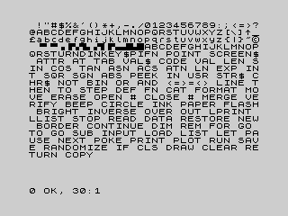

# INKEY$ and his 8 legs

Back in the 80s, kids who had a ZX Spectrum or ZX-81 actually learned to program
before they could read and write. This doesn't sound very believable, but it's
the main reason Eben Upton and co. created the Raspberry Pi, so I thought I'd
say something about how that worked.

## Budget computing

The Speccy's crude operating system was a BASIC command line interpreter,
complimented by a simple line editor. When you switched the thing on, the
machine's circuits whistled with a high pitched coil whine inaudible to adults,
the screen flashed black as the memory's graphics region was reset, and about a
second later you were presented with Sinclair BASIC's operating system:


Well, to be more accurate, it wasn't when you switched it on, it was when you
plugged it in. Extravagant luxuries like an on/off switch had no place in
Sinclair's quest for affordable home computing.

An on/off switch wasn't the only missing feature - budget home computers of the
80s outsourced their peripherals to existing consumer electronics. Cathode ray
tube monitors with were far too expensive, and ones with digital inputs had no
other function, so, like gaming machines of the 70s before it, the Spectrum came
with an RF transmitter. You'd connect it to the family TV's aerial port with a
coax cable, and tune it in the best you could.

More expensive devices had disk drives, but on machines like the Spectrum,
Commodore 64 and Amstrad CPC series, games were stored on audio cassette tapes
that you played into the MIC port from radio cassette player's headphone/mic
socket, using a splitter cable to separate the MIC and EAR channels.

## A conflict of interest

The main reason to buy a home computer was to play games, but the reason
engineers made home computers was to bring the glory of computing into the home.
So, gaming was the killer app but also a grubby degenerate secondary function,
kind of like porn was to the early Internet. And like that conflict caused Flash
Player to dominate the web for a decade, this one led to a user experience that
few would stand for today: To load a game, you had to instruct the thing to do
the loading, you had to enter the `LOAD` keyword into the CLI.

This sounds simple enough, but like the rest of the ZX Spectrum's quirks, this
was famously awkward and different to every other platform due to budget
constraints.

## The ZX character set

Short on RAM, CPU and long on ideas, the boffins at Nine Tiles decided that
their BASIC interpreter could do without a lexical parser, so they assigned all
possible functions to their extended character set. Characters `0xA5` to `0xFF`
became entire words rather than a single character. To input them, the text
cursor switched between modes depending on context, a flashing `K` for keyword
input, an `L` for letters and so on, which acted as extended form of the SHIFT
key.

Here's the output of a BASIC program that prints the set, taken from Wikipedia:



To help with the task of input, the budget rubber keyboard had all the keywords
printed on it. So, getting back to the loading ritual, to load a game you'd find
and tap the key with the word `LOAD` on it:


If you didn't spot it, `LOAD` was *conveniently* located on the J key. Then we
tap `ENTER`, right?

Nope! You also had to pass the name of the program you wanted to load. Not that
anyone actually used this name filter, as that'd mean sitting there for 4
minutes listening to some other program's memory dump. I like to think it was a
psyop by Steve Vickers to teach programming by stealth. Maybe it wasn't, but it
certainly worked that way, and unlike the `LOAD` keyword there were other
commands that had optional string parameters.

If, like everyone, you didn't know or care about the name of the program, then
you just entered an empty string: a pair of empty double quotes. These, even
more conveniently than `LOAD`, were inserted by holding down the aptly named
`SYMBOL SHIFT` key then squishing the P key down twice. Then you finally pressed
`ENTER` and clunked down the play mechanism on your cassette player.

If the tape wasn't too worn, too stretched and hadn't got too hot or too damp,
it wasn't wound too tight, and wasn't an 8th generation copy from a chain of
people's mums' dual cassette decks with Hi-Speed Dubbing, it might load. But
only if the impatient kids didn't shock the tape heads by jumping about the
room, or squabbled too roughly. And so your game would be ready to play in 3-4
minutes.

That 4 minutes felt like a whole day.

## GOTO 10

The flashing cursor and looming 4 minute eternity were an open invitation for
kids to play with the other keys. If you pressed the P key it typed `PRINT`, and
if you put some letters between the quotes after it then it'd whatever you wrote
to the screen (in CAPS, because the `CAPS SHIFT` key was for the exotic and
alien lower-case letters, a rare sight on the device).

If you wanted some real fun, you could put a number before the keyword and it'd
get saved to one of the 9,999 available line numbers instead of just running it.
Then you'd run them in line-order with the R key, or `GOTO` one of them with the
G key. So we did.

```basic
10 PRINT "HELLO"
20 GOTO 10
```

And that's how I became an illiterate programmer. I couldn't spell `LOAD` or
`CLEAR` on my own at the age of 6, even `BEEP` was spelled strangely, but it
made music if you gave it some numbers.

This is how Sir Clive Sinclair earned his knighthood, he created a generation of
programmers who learned to code while still learning the basics of reading and
writing. We went on to [⏯ transform the world](https://youtu.be/IagZIM9MtLo).

## An imaginary friend

If you wanted to take a key from the keyboard without waiting for someone to
`ENTER` it, which you had to do if you wanted to move a `▄█▄` around the bottom
of the screen, you'd use the `INKEY$` keyword to save it to a variable. Or a
"little box". Input key, dollar meaning it returns a string.

If you're 6 years old, don't know what "input" means and call your keys
"buttons" then `INKEY$` conjures up images of a friendly octopus with his arms
all over your buttons catching the ones you press. Well, legs actually, because
only humans have arms.

To me, and me alone it seems, `INKEY$` is a friendly cartoon octopus printed on
4 inches of thin card. One with SEE INLAY FOR DETAILS written along the side.

Ah.. memories!
