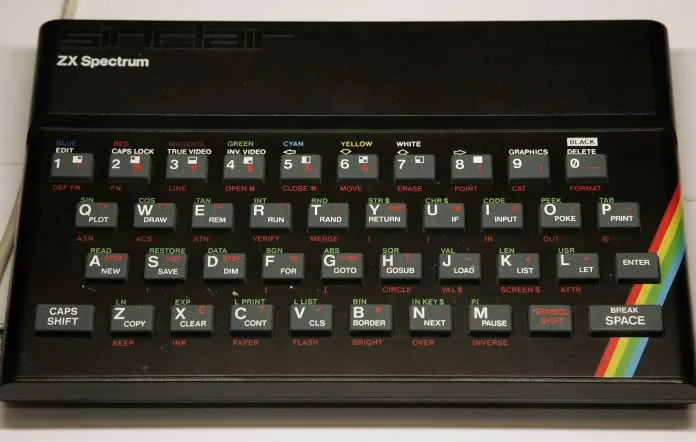
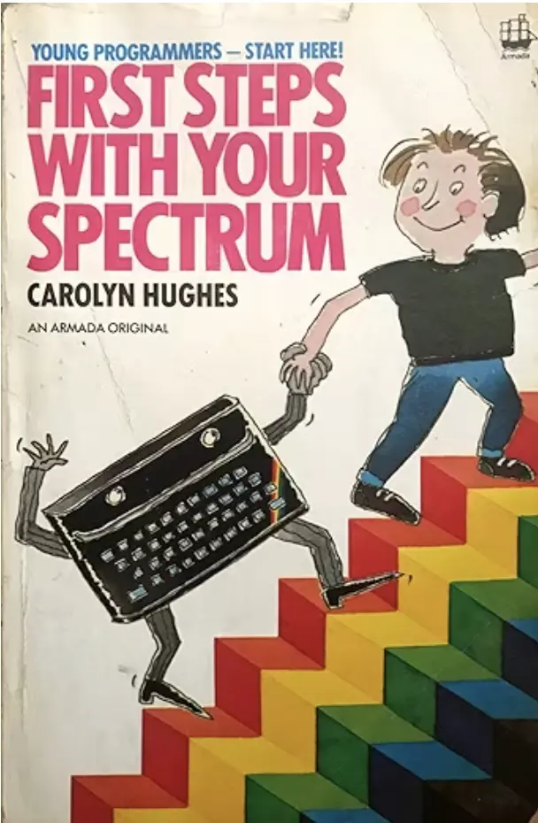
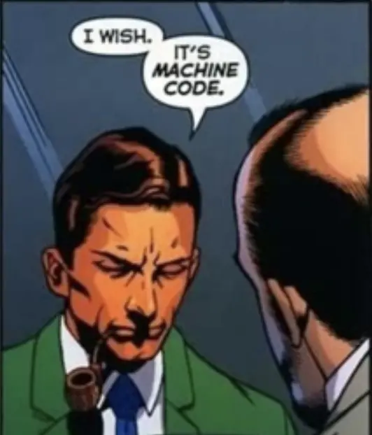

# Beginner's All-purpose Symbolic Instruction Cackronym

I started off programming on a 16k ZX Spectrum that my uncle sold cheap to my
dad in 1985, saying "you want to get your Gareth into programming, it's gonna
be big", turns out he was right.

I had a Speccy from age six until I was 13, when I got an Amiga, and I don't
have any of my old tapes digitized - I might have on my old Amiga hard drive
but it's not to hand and I don't have a TV for it.

But here's a bit of nostalgia for it.

## INKEY$ and his 8 legs

The cool thing about the machine is that to load a game you had to type a
command, the `LOAD` keyword. Since the Speccy didn't have free text input in
its BASIC operating system, each command was actually assigned to a special
character and pressing a button in Keyword input mode would insert that
character and it'd be displayed as the command you wanted, in this case
`LOAD`.

`LOAD` was *conveniently* located on the J key. But that wasn't enough to load
a game, nope, you also had to pass a parameter - the name of the program you
want to load from tape. Not knowing what the name of the program was, you could
leave that blank by typing a pair of empty double quotes, which, just as
conveniently were entered by holding down the aptly named `SYMBOL SHIFT` key
and pressing P twice. Then you pressed `ENTER` and play on your cassette tape
player. If the tape wasn't too worn or stretched and hadn't got too hot or damp,
and it wasn't an 8th generation pirate copy made by Hi-Speed Dubbing on your 
mum's dual cassette deck, your game would load in 5 minues or so.

This ritual was performed each time you loaded one of the many (excellent)
games, but you could also mess about with it instead. You could press any of the
other keys, like P for `PRINT` and put some text in your quotes, it'd print the
text to the screen. And if you wanted some real fun, you could put a number
before the instruction and it'd get saved to that line number. Then run them in
line-order with the R key.

Congrats, you're now a programmer. And you haven't even learned to read and
write yet really, you couldn't spell `LOAD` or `CLEAR` on your own because
they're pretty strange spellings. But `BEEP` is fun, it makes music if you give
it some numbers. If you wanted to take text from the keyboard and save it in
a letter you used the `IN KEYS$` command. Input keys, dollar meaning string.
But if like me you're 6 years old and don't know what "input" means and call
your keys "buttons" then `INKEY$` conjures up images of a friendly octopus with
his arms all over your buttons feeling for them.

That's how I became a programmer, it's how a lot of kids became one. Sir Clive
Sinclair earned his knighthood ten times over by creating a generation of
bedroom programmers who couldn't even read and write yet, then later went on to
[transform the world](https://youtu.be/IagZIM9MtLo). And to me, and me alone it
seems, `INKEY$` is an imaginary cartoon octopus that would be at home next to
the text SEE INLAY FOR DETAILS.

## Learning before the Internet

Before we had the web, we had books and magazines. 

### First steps with your spectrum

### Input Magazine

## It's machine code

### Gareth's UDG planner

todo: making sprites on the ZX spectrum

### PEEKing and POKEing

todo: Uncle Phil's letter deciphering the PRINTAT command

## Other BASICs

## THIS IS WHAT THE ENEMY LOOKS LIKE

todo: rant about Microsoft and what they did to us

