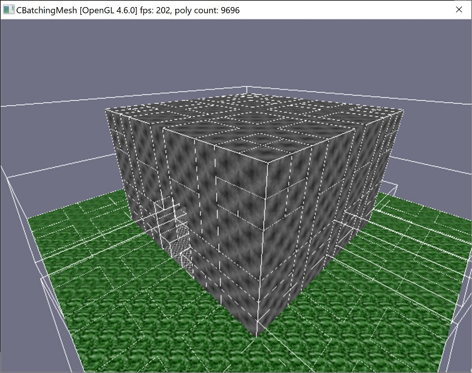

# CBatchingMesh

[demo](CBatchingMesh.zip) |
[src](https://sourceforge.net/p/irrext/code/HEAD/tree/trunk/extensions/scene/IMesh/CBatchingMesh)

## CBatchingMesh v 0.2

by: Gaz Davidson (gaz@bitplane.net)
License: Irrlicht Engine License

This Mesh type allows users to batch up a lot of different meshes into several mesh buffers.
It's useful for things like tile-based games where many tiles share the same materials.
You simply throw all your tiles into this one mesh and it will group them by vertex
type and material, and split them into as many different buffers as are required. You are then
free to create an OctTreeSceneNode or MeshSceneNode and triangle selectors in the usual way.

To use it, simply create the new mesh type and then add meshes into it using addMesh or
addMeshBuffer, using either position/rotation/scale or a matrix.

When you are finished adding, call update() to generate the mesh buffers.

If you don't need to ever change the data, you can call finalize() instead, which will call
update() and then drop the source buffers. You cannot add to or move the mesh data after
doing this.

limitations/considerations
--------------------------

There will be two copies of the mesh data in system RAM, as it grabs meshbuffers and only
drops them on destruction.

If you change the mesh buffers, bad things can happen! :
 - If you add triangles to a mesh buffer it will not add them after an update().
 - If you remove triangles, it will crash on update().
 - addMesh only adds the mesh buffers from that mesh, it doesn't track (for example) the number
   of buffers in each mesh and update as needed.

It does not split mesh buffers or reorganise triangles. If the current buffer will end up too
large, then it just starts a new buffer (for ease of moving)

todo
----

Implement CBatchingMesh::getMesh(SMaterial)

changes
-------
0.2 - 6th June 2007
added clear(), finalize(), moveMesh(), moveMeshBuffer(), getSourceBuffer() and getMatrix()
addMesh and addMeshBuffer now use a const matrix reference
added an extra param to isDirty, for checking the status of destination buffers.

0.1 - 4th June 2007
initial version
