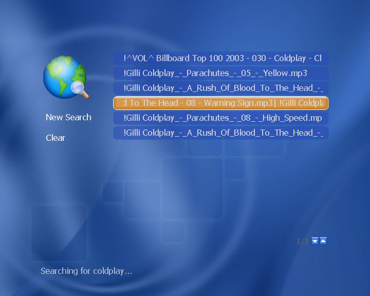

# XBMC IRC

People used to download their media from IRC at the time, and as a bit of a 
muso, my contribution was to create a GUI for MP3 file sharing over IRC. The
idea was that you use the remote to search for files, download them, and
anything you did download was then shared with others in the channel. The bots,
although not part of the community, would act as a cache for the real users who
hung out in the chat sharing music.

I think this was the first IRC client that I wrote, although I used a library
for it I did know a fair bit about it by that point thanks to [mIRC](/dev/mirc)
scripting.

Here's some screenshots I managed to salvage from the wayback machine. Note the
crap taste in music in the images because I wanted it to be popular (it wasn't).

And here's [the code](xbmcirc014.rar), in a RAR file, as it was back then.

## Docs

XBMC IRC Share v0.1.4 by Bitplane

### intro

A simple interface for sharing media on IRC.

* Full featured SDFind/SPR-Jukebox style IRC file server 
  (@find,@nick,!list,queues,etc)
* DCC resume (send and receive)
* Sits in the background
* looks pretty! Images stolen from foood's icons - www.foood.net :) 

click on "launch.py" to start the script (or to show it if it's hidden)

### MANNERS

So, you just walked in to someone's chat room with absolutely no way of
communicating with anyone, and proceeded to help yourself to their files
and bandwidth. Kind of cheeky, don't you think? 
Nobody likes faceless robots that do nothing but leech their servers, and
operators just love finding excuses to kick and ban people. 
Channels are ranked by the number of people inside. It is good manners to
"idle" in a channel if you like it, that is to sit there and do nothing but
keep the numbers up.

Another thing that everyone loves is a new server, so...

### SHARE!!

You'll need to set up a couple of things if you're gonna do the right thing...

To look up your own host name you'll need DNS working, which means putting at
least one IP address in your DNS settings in your dashboard (or
xboxmediacenter.xml if you use xbmc as a dash). To get the IPs of your (two)
DNS servers, open a DOS prompt (start menu, run, cmd.exe) and type
"ipconfig /all".

If you use your xbox with windows internet connection sharing and you want to
share your MP3s, your xbox will need a static IP and you'll need to set up
port forwarding. If you have a router and use IRC you should know all about
this, everyone else can use this internet connection sharing tutorial. 

Setting up port forwarding using ICS:

1. Open the control panel and go to "network and Dial-up Connections"
2. Right click on your modem and select properties, click the sharing tab 
   ("enable internet connection sharing for this device" should be ticked)
3. Click the settings button, then on to the Services tab, then the add button
4. Pick a name for your service, eg. XBOX MP3 Server
5. For service port number, pick a four digit number and make a note of it. 
   ie 6600
6. The TCP protocol should be picked, rather than UDP
7. And finaly enter the IP of your XBOX, for example 192.168.0.5
8. If you want to send more than one file at a time, you'll need to add a
   service for each send slot, so go back to step 3 and add some more. Increase
   the port number by one for each new send slot, like 6601, 6602 and so on
9. Open the script and go the the settings screen, then change serverport and
   maxsends accordingly. in this example serverport=6600 and maxsends=3.

Finding new channels

#mp3passion on irc.undernet.org is the biggest mp3 channel at time of writing
(1200+ people), but biggest isn't always best. If you want stability, less lag
time and less time waiting in queue you're best off finding a channel on a small
network, or one that caters for your favourite type of music (defaults to 
`#mp3_galaxy` on newnet)

You can search for channels at http://irc.netsplit.de/channels and check them
out on your PC with mIRC (www.mirc.com). If you arrive in a place and people's
server adverts are saying 'type @myname for my list of howevermany files' then
you can safely add it. It won't work with XDCCs ('To request a file type:
"/msg MYNICKNAME XDCC send #x"') or Fservers
('File Server Online  Triggers: typethis! & typethis2').

To join a password protected channel, put the password after the name of the
channel like this:

    #mychan password

