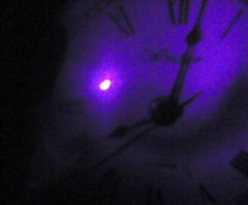
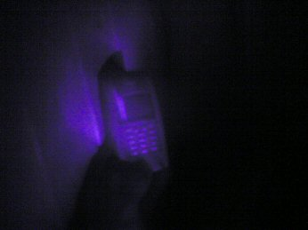
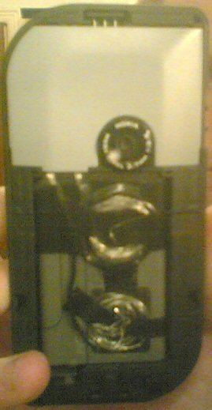
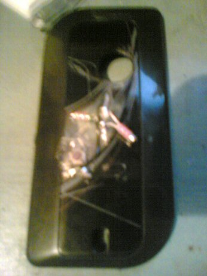

# Infrared

Turning your phone in to a James Bond spy device

While browsing eBay one day I stumbled across some cheap night vision webcams,
which made me curious. Why were they so cheap? If they were a whole different
technology from normal digital cameras then surely they'd be quite expensive.
Browsing through the pictures, I decided they looked like normal digi-cams
with infrared LEDs stuck on the front. Pointing my trusty Xbox remote at my
camera, I was surprised to see the light from my remote show up blue.

 

blurred piccies using digital zoom

 

Much better snaps with the flashlight propped up 6ft away

For some reason I expected the torch to have some kind of magic bulb that I
couldn't find in the shops, but it turns out it's your usual kind of bulb
hidden behind an infrared filter. Googling finds someone
[selling infrared filters for maglites](https://web.archive.org/web/20060430130020/http://www.a1.nl/phomepag/markerink/for_sale.htm),
and an [almost free alternative](https://web.archive.org/web/20060430130020/http://www.rit.edu/%7Eandpph/text-infrared-filter.html).
It seems that two layers of 35mm film will work as an infrared filter.
Man, that torch was a complete waste of money. So, this got me thinking.. I
wonder if I could botch my Nokia 7610, tap the battery, attach a switch, add a
filter and a small bulb to the outside, and then take pictures in the dark...

## Ingredients

You will need...

* One cheap phone cover
* A sub standard, exploding battery (optional)
* One replacement bulb for an AA sized maglite
* An under-exposed, developed negative (ask a girl)
* One teeny-weeny sub-micro switch (I used a KR88 from Maplin)
* Some copper wire
* Some insulation tape
* Cellotape (kitchen drawer)
* A pair of scissors/wire cutters
* A soldering iron (next to the stack of xboxes ;)
* (20 years later, with hindsight): Apparently, a calculator and the correct
  resistor.

## Power

* 2024 update: Yeah this is probably a really bad idea, but I'm putting it back
  up again in the spirit of the old Internet. Don't do it though. I didn't know
  what I was doing at the time. Modern batteries are 

Cut two lengths of wire a bit longer than the battery, crimp them so that they
touch the contacts. You can solder them on if you like, or tape them - 
whatever you do remember to keep it thin or you'll have trouble getting the
battery in and out. I taped mine on the back.

Next you'll want to strip and then coil wires around a few times like a spring.
They'll need to push against the back of the case.

## The case

Melt two small holes in the back cover with your trusty soldering iron (you
could drill, but I'm messy), poke lengths of wire through them and line them
up. Strip and tape the wires making sure there's no tape where they line up
with the coils on the battery side.

## The bulb and switch

I chose to be messy here. I cut a hole in the back cover with the soldering
iron and welded the microswitch. Solder the switch to one of the wires on the
outside, solder the bulb on. Put the case back together and test out your
phone torch!

## The Results

Unfortunately I didnt get as far as the filters. The thing worked, but the
bulbs life was rediculously short. I blew both my bulbs, then some infrared
LEDs, snapped the inset in half. The mark 1 was a complete failure. It was
fun though and I might try it again one day.

One day when I know something about basic electronics.

2024 note: I didn't!

